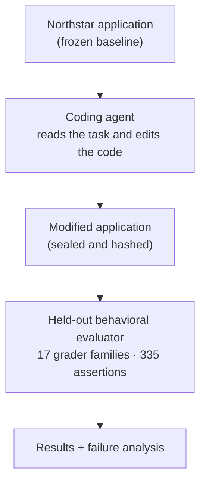

# LLM Coding Agent Evaluation

**A held-out evaluation that tests whether an AI coding agent can safely add a complex feature to an existing production-style application.**

An AI coding agent is given an unfamiliar e-commerce codebase and a written business specification. It must build a full promotion and discount system without breaking anything that already works. A private evaluator then exercises the running application from the outside and checks **335 specific behaviors**, using deterministic checks rather than human opinion or LLM judgment.

## At a Glance

| | |
|---|---|
| **What is being evaluated** | AI coding agents working on a realistic existing codebase |
| **The task** | Add an 11-type promotion system (discounts, coupon codes, stacking rules, redemption limits) to a commerce app while preserving checkout, payments, and existing behavior |
| **How it is graded** | A held-out evaluator with 17 grader families and 335 deterministic assertions, run against the agent's finished, sealed submission |
| **Headline result** | GPT-5.6 Sol High (via Codex) passed **334 of 335** assertions. An earlier GPT-5.6 Luna run passed 168, with 104 failures and 63 blocked. |
| **What it taught us** | For strong coding agents, this task is approaching saturation. The next evaluation targets harder capabilities: long-horizon, multi-source, organizational reasoning. |
| **My role** | Evaluation designer: I defined the capability, requirements, grading methodology, and experiments. I directed AI coding agents that implemented much of the code, and I validated the evaluator and analyzed the results. |

## What the Agent Has to Do

The agent receives **Northstar Outdoor Living**, a fictional but realistic e-commerce application: catalog, carts, customer accounts, checkout, an external payment processor, and an admin site. It has never seen this codebase before.

It is asked to add a promotion system that:

- supports **11 promotion types**, from "20% off this product" to "Buy X, get Y at N% off, limit Z" and free shipping;
- handles **coupon codes**, customer eligibility, start/end dates, and redemption limits;
- stacks multiple promotions correctly and respects **minimum advertised price (MAP)** rules;
- calculates tax, shipping, and rounding correctly after discounts;
- stays correct under **concurrent checkouts**, retries, and payment failures;
- keeps completed orders historically accurate even if promotions change later;
- exposes a documented admin API so promotions can be managed programmatically;
- **does not break** any existing Northstar behavior.

The full candidate-visible task is in [`candidate/TASK.md`](candidate/TASK.md).

## How the Evaluation Works



1. Each trial starts from an identical, hash-verified copy of Northstar in an isolated workspace.
2. The agent sees only the task, the admin API contract, and the code. It has no access to the evaluator.
3. When the agent finishes, the workspace is **sealed**: snapshotted, hashed, and frozen.
4. The evaluator builds the sealed submission, runs it in Docker, and drives it like real users and administrators would, through web pages, HTTP APIs, and a simulated payment processor.
5. Every assertion records PASS, FAIL, BLOCKED, or ERROR, with the evidence behind it.

The evaluator checks **what the application does**, not how the code is written. Any internal design that produces the correct behavior passes.

## Results

Two trials were graded against the same evaluator, task, and frozen baseline.

| | Trial 001 | Trial 002 |
|---|---|---|
| Agent / model | Codex / GPT-5.6 Luna | Codex / GPT-5.6 Sol High |
| **PASS** | 168 | **334** |
| **FAIL** | 104 | **1** |
| **BLOCKED** | 63 | 0 |
| **ERROR** | 0 | 0 |
| Total assertions | 335 | 335 |
| Existing behavior preserved (baseline regression) | 26 / 26 | 26 / 26 |
| Grader families fully passing | 1 of 17 | 16 of 17 |

- **Trial 001** kept the existing application working but built only a small part of the promotion system. The evaluator separated real failures from scenarios that could not be reached (BLOCKED) instead of counting everything as a failure.
- **Trial 002** passed every promotion-economics, stacking, MAP, checkout, concurrency, idempotency, payment-consistency, and historical-integrity grader. The single failure was in the admin API: for one class of malformed identifier, the web framework's default error format was returned instead of the documented error format.

Details: [Trial 001 summary](results/TRIAL_001_SUMMARY.md) · [Trial 002 summary](results/TRIAL_002_SUMMARY.md)

## What We Learned

**A strong coding agent nearly solved this task.** One frontier model, in a single run, satisfied 334 of 335 held-out checks, including concurrency and payment-consistency checks that are often hard to get right.

That is a useful result, and it changes what to do next:

- It **does not** show that every frontier model would score this well, or that one run is a reliable measure. One trial per model is not a reliability estimate.
- It **does** suggest that this particular task is approaching saturation for strong agents.
- Making the evaluation harder by adding obscure coupon edge cases would measure trivia, not capability. The better move is to **evaluate a different, harder capability**.

The failure analysis was also a test of the evaluator itself. Before accepting the one Trial 002 failure, I traced it back to the candidate-visible contract to confirm the requirement was fairly stated and that other valid implementations could pass. It was a genuine candidate defect, not a grader bug.

## What I Designed (My Role)

This project used an **agent-assisted engineering workflow**. I owned the evaluation design and the judgment calls. AI coding agents (Claude Code) implemented substantial portions of the environment, harness, and graders, under my direction and review.

**I was responsible for:**

- defining the capability being measured and the business requirements;
- writing the success criteria and the candidate-visible task and contract;
- designing the grading methodology, grader architecture, and result model;
- requirements traceability: making sure every assertion maps to a requirement the candidate could actually see;
- finding and removing **unfair or solution-dependent grading assumptions**;
- directing the implementation and revisions of the environment, harness, and graders;
- validating the evaluator before candidate trials;
- designing the trial protocol (isolation, sealing, provenance);
- running the trials, analyzing failures, and interpreting the results.

**AI coding agents implemented**, under that direction, much of the Python in the Northstar environment, the evaluation harness, and the grader families. I reviewed and revised their work, often over several iterations.

The candidate models under test (OpenAI models via Codex) are separate from the development agents used to build the evaluator.

## Evaluation Methodology

The short version (the full version is in [`docs/EVALUATION_METHODOLOGY.md`](docs/EVALUATION_METHODOLOGY.md)):

- **Observable outcomes.** Grade what the running application does: prices, totals, payments, redemption counts, order history. Never grade preferred code structure.
- **Solution independence.** The agent may choose any schema, framework pattern, or algorithm. The evaluator does not inspect the agent's code or database tables; it uses documented interfaces and evaluator-owned systems.
- **Deterministic grading.** Money, concurrency, and state are objectively checkable, so every reported assertion is deterministic. There is no LLM-as-judge in the scored results.
- **Candidate-visible requirements, hidden measurement.** The agent receives the business rules and interface requirements needed to solve the task. The exact evaluation scenarios and assertions stay private.
- **Requirements traceability.** Every assertion is linked to a candidate-visible requirement and a success property.
- **Four outcomes, not two.** PASS, FAIL, BLOCKED (a prerequisite failed, so the behavior could not be tested), and ERROR (an evaluator problem, never counted against the candidate).
- **Grader validation.** The graders were tested against a known-good reference, deliberately broken variants, and changes that a valid alternative implementation is free to make.
- **Reproducible, immutable trials.** Hash-verified baseline, isolated workspace, sealed submission, recorded evaluator version, one immutable directory per grading run.

## Northstar Environment

[`environment/northstar/`](environment/northstar/) contains the exact frozen **Northstar v1.0.1** application baseline used to create each candidate workspace.

It is a Python web application with a storefront, customer accounts, persistent carts, an admin site, and an idempotent checkout. Checkout talks to **FakePay**, a separate simulated payment processor, and recovers safely from payment timeouts and failures. It ships with its own regression test suite, including concurrency, idempotency, and fault-injection tests.

Northstar is fictional and contains only **dev-only, publicly documented credentials**. See [`environment/README.md`](environment/README.md).

## Repository Structure

```text
.
├── README.md                     You are here
├── candidate/
│   ├── TASK.md                   The exact task given to the coding agent
│   └── PROMOTION_ADMINISTRATION_INTEROPERABILITY_CONTRACT.md
│                                 The exact admin API contract given to the agent
├── environment/
│   ├── README.md                 What Northstar is and how to run its own tests
│   └── northstar/                Frozen Northstar v1.0.1 (the candidate's starting point)
├── docs/
│   ├── EVALUATION_METHODOLOGY.md How grading works and why
│   └── EVALUATION_ARCHITECTURE.md How trials are created, sealed, and graded
├── results/
│   ├── TRIAL_001_SUMMARY.md      Sanitized Trial 001 results
│   └── TRIAL_002_SUMMARY.md      Sanitized Trial 002 results
└── examples/
    ├── README.md                 Illustrative only: not held-out material
    └── illustrative_assertion_results.json
```

## What Is Public vs. Held Out

This repository contains the complete candidate-visible task and environment, the evaluation methodology, illustrative examples, and sanitized experimental results.

**Exact held-out scenarios and grader assertions remain private** so they do not become optimization targets for future candidate agents. If the tests were public, a future model could be trained or prompted against them, and a high score would no longer show that it can do the work.

| Public | Private (held out) |
|---|---|
| Candidate task and admin API contract | Evaluator and grader source (G01–G17) |
| Frozen Northstar baseline | Exact scenarios, assertions, and HTTP requests |
| Methodology and architecture | Fixture catalog and deliberate edge-case values |
| Aggregate results by grader family | Known-bad validation implementations |
| Illustrative examples | Raw trial traces and full grader evidence |

## Limitations

- **Small sample.** One trial per model. These results show what happened in each run, not a reliability estimate or a model ranking.
- **Near saturation.** For the stronger agent tested, this task is close to its ceiling, so it now separates weak agents from strong ones better than it separates strong agents from each other.
- **Outcome-focused.** The scored results measure the final application. Agent trajectories, cost, and token usage were not part of scoring for these trials.
- **One domain.** This is commerce promotion logic in one Python codebase. Results may not transfer to other domains, languages, or larger repositories.
- **No published aggregate score.** Results are reported as raw assertion counts and categories. A weighted score was intentionally not finalized.
- **Partially reproducible from this repository.** The task and environment are public, but rerunning the grading requires the private evaluator.

## Next Evaluation: MCP + Long-Horizon Organizational Reasoning

*This is future work. Nothing below is implemented in this repository.*

The next evaluation will move from "implement a well-specified feature" to work that looks more like a real engineer inside a company:

- using **Model Context Protocol (MCP)** tools and resources;
- navigating a larger fictional company built around Northstar;
- discovering, interpreting, and following company conventions distributed across organizational documentation and systems;
- reconciling **multiple information sources**, including stale or conflicting documentation;
- cross-system reasoning, permissions and authorization, and **production-safe** changes;
- potentially retrieval (RAG) and grounded reasoning, where it fits the capability.

The same principles carry forward: candidate-visible requirements, held-out deterministic measurement where possible, and validated graders.

## Technical Details

- **Application:** Python 3.12 target runtime (3.11+ is sufficient for local testing), FastAPI, Starlette, Jinja2 templates, SQLAlchemy 2, Alembic migrations, PostgreSQL 16 (psycopg 3)
- **Payments:** FakePay, a separate FastAPI service simulating an external payment processor
- **Testing:** pytest, with Northstar's own regression suite covering concurrency, idempotency, and fault injection
- **Evaluation runtime (private):** Docker / Docker Compose, a Python evaluation harness with HTTP clients that behave like browser form submissions
- **Candidate agents:** Codex with GPT-5.6 Luna and GPT-5.6 Sol High
