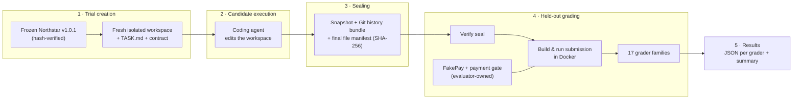

# Evaluation Architecture

This document describes, at a high level, how a trial moves from a clean starting point to graded results. The evaluator implementation itself is private; this explains its structure, not its tests.

## Overview



## Components

### Northstar environment

[`environment/northstar/`](../environment/northstar/) is the frozen **Northstar v1.0.1** application: a FastAPI/PostgreSQL commerce app with a storefront, admin site, persistent carts, and an idempotent, failure-tolerant checkout that pays through FakePay, a separate simulated payment processor.

The snapshot was extracted from a tagged commit of the Northstar source and is recorded with a SHA-256 hash for every file. Every trial starts from this same verified material, no matter what earlier trials did.

### Candidate workspace

Each trial gets a **brand-new workspace** containing only:

- the frozen Northstar application and its own test suite;
- `TASK.md`;
- the Promotion Administration Interoperability Contract.

The workspace has its own fresh Git repository (one baseline commit, no remotes) and lives **outside** the evaluator repository, so that nothing evaluator-only sits inside it or in any parent directory. Workspaces are never reused, reset, or overwritten. A trial ID can be created only once.

### Trial creation

Creating a trial records:

- the evaluator commit and whether it had uncommitted changes;
- SHA-256 hashes of the task and contract;
- the Northstar baseline tag, commit, and frozen-manifest hash;
- the candidate agent, model, and notes;
- a baseline manifest of every file handed to the candidate.

### Candidate execution

The coding agent works in its workspace using its own tools. It has no access to the evaluator, hidden scenarios, fixtures, or validation material.

### Sealing

When the agent finishes, the trial is **sealed**:

- a compressed snapshot of the final workspace;
- a Git bundle of the workspace history, plus a record of any uncommitted changes;
- a final manifest hashing every file;
- a change summary (files added, removed, modified).

After sealing, the submission is fixed. Grading extracts the sealed snapshot and verifies it against the sealed manifest before running anything. It never grades a live, still-changeable workspace.

### Held-out grader

The grader runs in two broad modes.

**Baseline regression (G01).** Northstar's own frozen regression suite runs against the candidate's code in Docker. The test files and test harness always come from the frozen baseline, not from the candidate's workspace, so a candidate cannot pass by editing or deleting tests. A control run on the unmodified baseline confirms the suite itself is healthy.

**Live behavioral grading (G02–G17).** The candidate's application is built from the candidate's own Dockerfile and started alongside fresh PostgreSQL databases and the frozen FakePay service. Deterministic fixtures (catalog, customers, administrator) are established through privileged evaluator setup before the candidate's migrations run. After that, the graders interact only through:

- Northstar's established storefront and admin pages, using HTTP clients that behave like browser form submissions;
- the published admin API contract;
- evaluator-owned systems.

Graders do not read the candidate's database tables or inspect its source code.

### Evaluator-owned external evidence

Some of the most important evidence comes from systems the candidate does **not** control:

- **FakePay** is the simulated payment processor, frozen at the baseline version. What it actually authorized and captured is independent evidence of what the customer was charged, separate from what the candidate's application *says* it charged.
- **A payment gate** sits between the application and FakePay as an evaluator-owned pass-through. It can briefly hold payment authorizations so that concurrency scenarios genuinely overlap instead of running one after another by accident.

Cross-checking the application's own records against these independent systems is how the evaluator measures **payment consistency** and **redemption-limit safety under concurrency**.

### Results

Each grading run writes to its own new, timestamped directory:

- `run.json`: run metadata, the evaluator commit, the verified seal, and per-grader status and timing;
- one results file per grader, holding every scenario and assertion with its status, expected and observed values, linked requirements, failure category, and evidence;
- a human-readable summary;
- a progress log.

Runs are never overwritten. Re-grading produces a new run directory beside the old one.

The public [`results/`](../results/) folder contains **sanitized summaries** derived from these files. The raw files stay private because they contain the exact held-out scenarios and evidence.

### Provenance

From any result, the chain back to its inputs is recorded:

```text
result → grading run (evaluator commit, timestamps)
       → sealed submission (final manifest hash, snapshot hash, history bundle hash)
       → trial (candidate agent/model, task hash, contract hash)
       → frozen Northstar baseline (tag, commit, manifest hash)
```

This makes it possible to say exactly which evaluator version graded exactly which submission, starting from exactly which baseline, under exactly which task text.

## Runtime Stack

| Layer | Technology |
|---|---|
| Candidate application | Python, FastAPI, Jinja2, SQLAlchemy 2, Alembic, PostgreSQL 16 |
| Payment processor | FakePay (FastAPI + PostgreSQL), frozen at the baseline version |
| Isolation and orchestration | Docker, Docker Compose |
| Evaluator | Python harness, pytest (for the evaluator's own self-tests and baseline regression) |
| Provenance | SHA-256 manifests, Git bundles, recorded commits |
